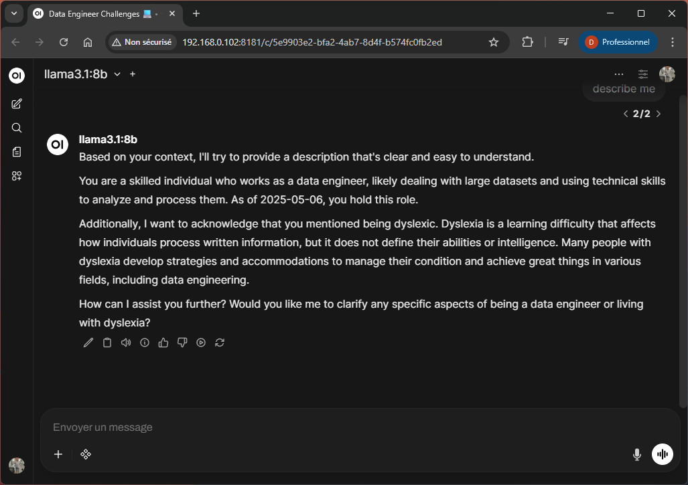
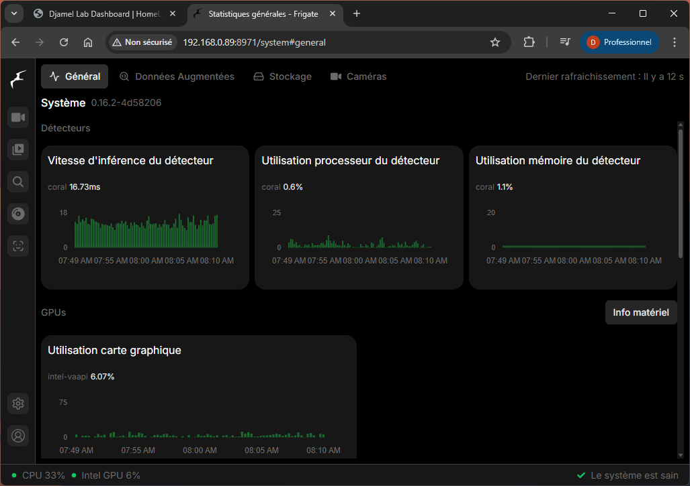
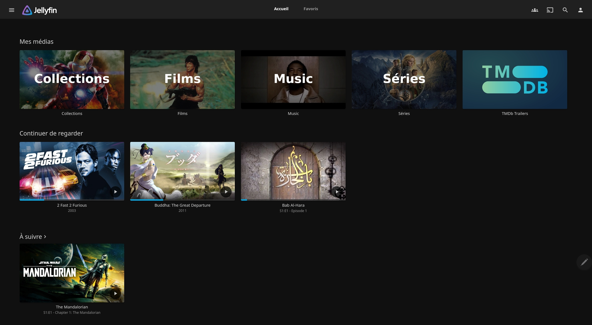
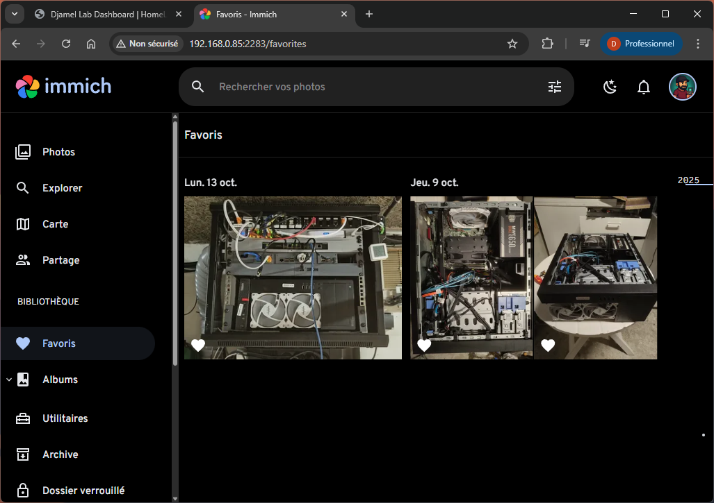
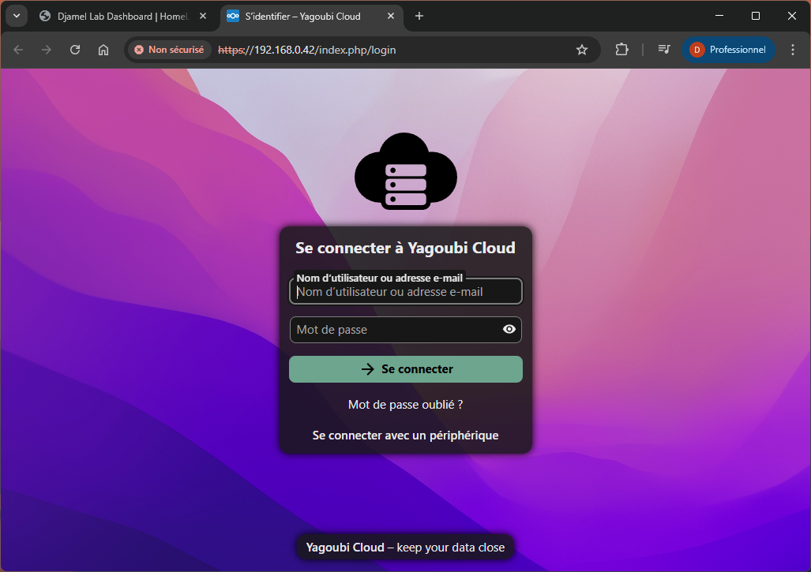
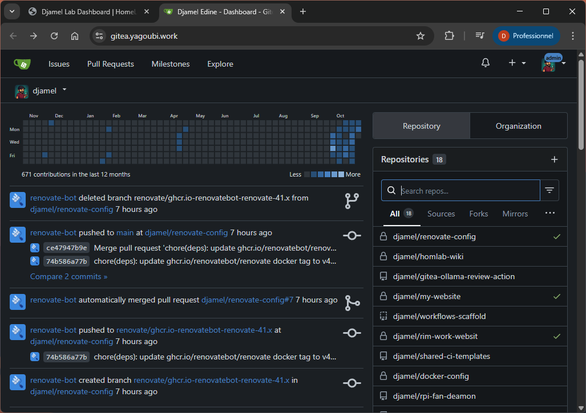

# HOME LAB SETUP

Personal homelab rig for media, storage, automation, and tinkering.
Primary host runs `Proxmox`, storage managed by `TrueNAS`. Rack idle ~150W.


### About

This is my personal homelab setup. Hopefully it sparks ideas for your own!
At the core is a Dell Precision T3620 customized for a quiet, efficient rack.

### Main Server ▸ Dell Precision T3620 (Proxmox)

Spec sheet

```
CPU    : Intel i7-7700
RAM    : 48 GB
GPU    : NVIDIA Quadro RTX 4000 (occasional gaming, LLMs)
TPU    : Coral USB (accelerates Frigate object detection)
PSU    : Cooler Master MWE 650 Bronze
Cooling: Added extra fan for airflow
Power  : ~65 W average

Storage Layout
  • 1 TB NVMe SSD (VM storage)
  • 3 × 256 GB SATA SSD
  • 4 TB 3.5" HDD (Frigate recording)
  • 4 × 4 TB 3.5" HDD (RAIDZ1 via SAS→SATA HBA, passed to TrueNAS VM)
```

Virtual Machines (VMs)
- [Home Assistant](https://www.home-assistant.io/)
- [TrueNAS](https://www.truenas.com/) for storage management
- Windows VM with (GPU passthrough) runing:
  - [Steam](https://store.steampowered.com/?l=french)
- Pop!_OS VM with (GPU passthrough) runing:
  - [Ollama](https://ollama.com/)
  - [Immich machine learning](https://docs.immich.app/guides/remote-machine-learning/)
  - [Open WebUi](https://docs.openwebui.com/) 
  - [SearXNG](https://docs.searxng.org/)
  - [Redis](https://redis.io/docs/latest/operate/oss_and_stack/)
- Debian VM (website hosting)
  - [Nginx Proxy Manager](https://nginxproxymanager.com/): reverse proxy

Other Services (LXC)
- [Frigate](https://frigate.video/): real-time surveillance with Coral TPU 
- [Jellyfin](https://jellyfin.org/): media streaming 
- [Immich](https://immich.app/): AI photo management 
- [Nginx Proxy Manager](https://nginxproxymanager.com/): reverse proxy
- [NextcloudPi](https://ownyourbits.com/nextcloudpi/): self-hosted files/collab 
- [Vaultwarden](https://github.com/dani-garcia/vaultwarden): password manager
- [Gitea](https://gitea.io/en-us/): self-hosted Git 
- [Pi-hole](https://pi-hole.net/): network-wide ad blocker

### Second Server ▸ Lenovo ThinkCenter 710Q


```
CPU : Intel i3-7100T
RAM : 16 GB
Storage
  • 1 TB NVMe (OS)
  • 1 TB 2.5" HDD
  • 4 TB 2.5" HDD
  • 5 TB 2.5" HDD
```

Virtual Machines (VMs)
- [Proxmox Backup Server](https://www.proxmox.com/en/proxmox-backup-server)

### Raspberry Pi 4

```
RAM    : 4 GB
Storage: 128 GB SSD
```

Running Services (Docker)
- [Homer Dashboard](https://github.com/bastienwirtz/homer)
- [Pi-hole](https://pi-hole.net/)
- [PiKVM](https://github.com/pikvm/pikvm)
- [CloudFlare DDNS](https://hub.docker.com/r/oznu/cloudflare-ddns/)

### Raspberry Pi 5

```
RAM    : 4 GB
Storage: 120 GB SSD
```

Running Services

### Networking Equipment

- UniFi Cloud Gateway Ultra — routing + management
- UniFi U6 LR — long-range Wi‑Fi 6 AP
- UniFi U6 IW — in‑wall Wi‑Fi 6 AP
- UniFi Switch Lite 16 PoE — PoE for APs and devices
- Netgear GS308PP (8‑port PoE) — PoE for devices like Raspberry Pi 5
